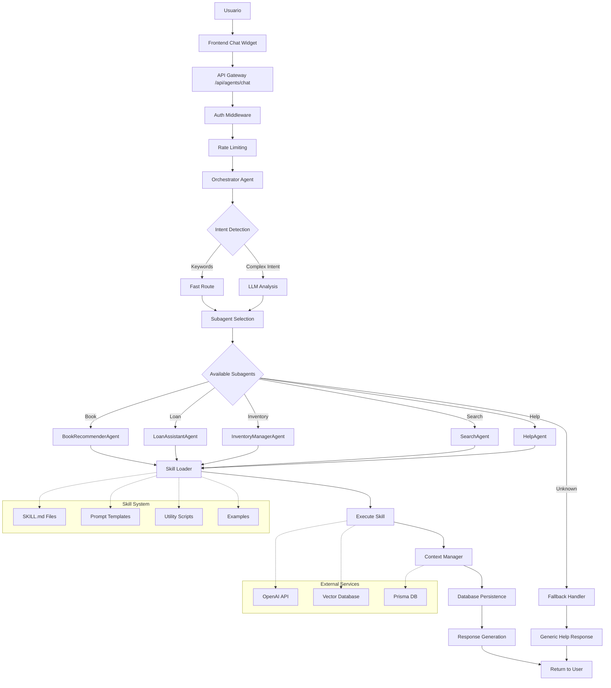

```mermaid
graph TD
    A[Usuario] --> B[Frontend Chat Widget]
    B --> C[API Gateway /api/agents/chat]
    C --> D[Auth Middleware]
    D --> E[Rate Limiting]
    E --> F[Orchestrator Agent]

    F --> G{Intent Detection}
    G -->|Keywords| H[Fast Route]
    G -->|Complex Intent| I[LLM Analysis]

    H --> J[Subagent Selection]
    I --> J

    J --> K{Available Subagents}
    K -->|Book| L[BookRecommenderAgent]
    K -->|Loan| M[LoanAssistantAgent]
    K -->|Inventory| N[InventoryManagerAgent]
    K -->|Search| O[SearchAgent]
    K -->|Help| P[HelpAgent]
    K -->|Unknown| Q[Fallback Handler]

    L --> R[Skill Loader]
    M --> R
    N --> R
    O --> R
    P --> R

    R --> S[Execute Skill]
    S --> T[Context Manager]
    T --> U[Database Persistence]
    U --> V[Response Generation]
    V --> W[Return to User]

    Q --> X[Generic Help Response]
    X --> W

    subgraph "Skill System"
        Y[SKILL.md Files]
        Z[Prompt Templates]
        AA[Utility Scripts]
        BB[Examples]
    end

    R -.-> Y
    R -.-> Z
    R -.-> AA
    R -.-> BB

    subgraph "External Services"
        CC[OpenAI API]
        DD[Vector Database]
        EE[Prisma DB]
    end

    S -.-> CC
    S -.-> DD
    T -.-> EE
```